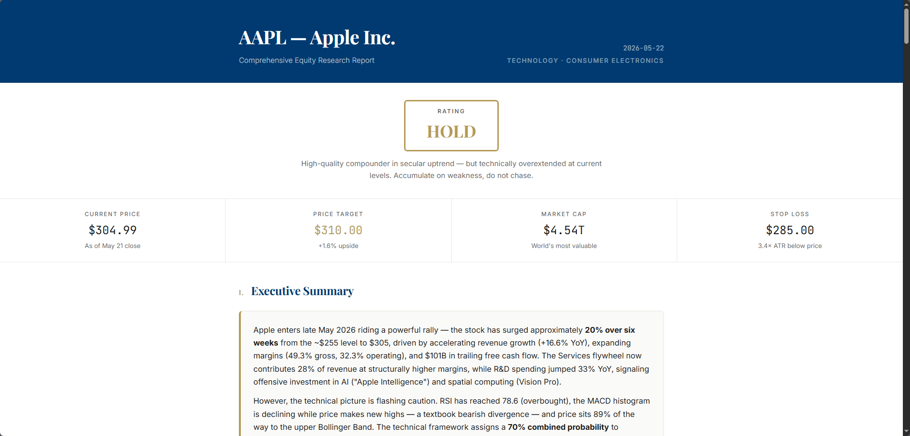

# TradingAgents-CN-lite

**Lightweight Multi-Agent Trading Framework** (A-share, HK, US, etc.)

[](LICENSE) [](https://www.python.org/) [](https://github.com/cy-Yin/TradingAgents-CN-lite/commits/main)

[English](README.md) | [中文](README_cn.md)

---

A lightweight fork of [TauricResearch/TradingAgents](https://github.com/TauricResearch/TradingAgents), adding **A-share market data** (BaoStock + AkShare + EastMoney Guba) while keeping the original CLI architecture intact. Inspired by [hsliuping/TradingAgents-CN](https://github.com/hsliuping/TradingAgents-CN).

> If you need a full-stack deployment with Web UI, database, and enterprise features, see [TradingAgents-CN](https://github.com/hsliuping/TradingAgents-CN).

> [!WARNING]
> This project is for **research and educational purposes only**. It does not constitute investment advice. Trading performance depends on many factors including model choice, market conditions, and data quality. Use at your own risk.

## Acknowledgments

| Project | Description |
|---------|-------------|
| [TauricResearch/TradingAgents](https://github.com/TauricResearch/TradingAgents) | The original multi-agent LLM trading framework |
| [hsliuping/TradingAgents-CN](https://github.com/hsliuping/TradingAgents-CN) | Full Chinese enhanced version with Web UI and enterprise features |

## Overview

### What It Does

You give it a **stock ticker** and a **date**. It runs a team of AI agents that analyze the stock from every angle — fundamentals, news, sentiment, technicals — then debate each other to reach a trading decision. The output is a **BUY / SELL / HOLD** recommendation with a full analysis report (Markdown + HTML in English & Chinese).

**Supported markets:**

- **A-share** — Shanghai (60xxxx), Shenzhen (00xxxx/30xxxx), Beijing (8xxxxx). Stock price and technical indicators from [BaoStock](https://github.com/jealous/stockstats); fundamentals, financial statements, and news from [AkShare](https://github.com/akfamily/akshare); retail sentiment from EastMoney Guba; macro news from CCTV Finance. Benchmark: CSI 300 / BSE 50.
- **Hong Kong** — via yfinance (e.g. `0700.HK`). Benchmark: Hang Seng Index.
- **US / Global** — via yfinance or Alpha Vantage (e.g. `NVDA`, `AAPL`). Sentiment from Reddit + StockTwits. Benchmark: SPY.

The system auto-detects the market from the ticker format — no manual config.

### What's Different

| Feature | [TradingAgents](https://github.com/TauricResearch/TradingAgents) (Original) | [TradingAgents-CN](https://github.com/hsliuping/TradingAgents-CN) | This Project |
|---------|--------|------|------|
| A-share price/indicators (BaoStock) | -- | Yes | Yes |
| A-share fundamentals/financials (AkShare) | -- | Yes | Yes |
| A-share news (AkShare) | -- | Yes | Yes |
| A-share retail sentiment (EastMoney Guba) | -- | Yes | Yes |
| A-share macro news (CCTV Finance) | -- | Yes | Yes |
| Chinese LLM providers | Yes (v0.2.4+) | Yes | Yes |
| US/HK/Global markets | Yes | Yes | Yes |
| CLI interface | Yes | -- | Yes |
| Web UI (Vue + FastAPI) | -- | Yes | -- |
| MongoDB / Redis | -- | Yes | -- |
| Docker deployment | Yes | Yes | -- |
| User auth & roles | -- | Yes | -- |

> [!NOTE]
> **Why "lite"?** TradingAgents-CN is a full product — Web UI, MongoDB, Redis, Docker, user auth, all included. This project is just the core engine + A-share data. No web layer, no database, no containers.

### How It Works

<p align="center">
  
</p>

> **Input:** stock ticker + date
> **Output:** BUY / SELL / HOLD + full analysis report (Markdown + HTML in English & Chinese)

#### Stage 1 — Analysis

Four specialist agents analyze the stock **in parallel**, each from a different angle:

| Agent | What it does | Data sources |
|-------|-------------|-------------|
| 📊 Fundamentals | Financial statements, balance sheets, cash flow | AkShare / yfinance |
| 💬 Sentiment | Social media & forum mood | EastMoney Guba / Reddit / StockTwits |
| 📰 News | Macro & company-specific news | CCTV Finance / yfinance |
| 📈 Technical | MACD, RSI, Bollinger Bands, etc. | BaoStock / yfinance |

#### Stage 2 — Debate

🐂 **Bull Researcher** argues FOR the stock.
🐻 **Bear Researcher** argues AGAINST.

They challenge each other's reasoning over **N rounds** until a winner emerges.

<p align="center">
  
</p>

#### Stage 3 — Decision

🧑‍💼 **Research Manager** synthesizes the debate into a unified report.
🤵 **Trader** makes the initial trading call.

#### Stage 4 — Risk Review

Three risk analysts debate the trade from different perspectives:

| 🔴 Aggressive | 🟡 Conservative | ⚪ Neutral |
|:---:|:---:|:---:|
| High risk tolerance | Risk-averse | Balanced view |

#### Stage 5 — Final Call

👑 **Portfolio Manager** makes the final **BUY / SELL / HOLD** decision.
📝 **Report Generator** produces structured Markdown + designed HTML reports.

## Quick Start

### 1. Install

```bash
git clone https://github.com/cy-Yin/TradingAgents-CN-lite.git
cd TradingAgents-CN-lite
```

<details open>
<summary><b>uv</b> (recommended)</summary>

```bash
# Install uv (pick one)
pip install uv           # via pip
brew install uv          # via Homebrew (macOS)
curl -LsSf https://astral.sh/uv/install.sh | sh  # standalone installer

# Create venv and install
uv venv -p 3.13
uv pip install .
```
</details>

<details>
<summary><b>conda</b></summary>

```bash
conda create -n tradingagents python=3.13
conda activate tradingagents
pip install .
```
</details>

<details>
<summary><b>pyenv</b></summary>

```bash
pyenv install 3.13
pyenv virtualenv 3.13 tradingagents
pyenv activate tradingagents
pip install .
```
</details>

### 2. Configure

Open `.env` and fill in the following:

**① API Key** — set one. Supports OpenAI, DeepSeek, Qwen, GLM, MiniMax, Claude, Gemini, Grok, Xiaomi Mimo, Ollama (local), and more. See `.env.example` for the full list.

<details>
<summary><b>Full provider list</b></summary>

| Provider | Env Variable | Models |
|----------|-------------|--------|
| OpenAI | `OPENAI_API_KEY` | GPT-5.5, GPT-5.4, GPT-5.2, GPT-4.1 |
| DeepSeek | `DEEPSEEK_API_KEY` | V4 Pro, V4 Flash, V3.2 |
| Qwen (International) | `DASHSCOPE_API_KEY` | Qwen 3.6 Plus/Flash, Qwen 3.5 |
| Qwen (China) | `DASHSCOPE_CN_API_KEY` | Same models, China endpoint |
| GLM (International) | `ZHIPU_API_KEY` | GLM-5.1, GLM-5, GLM-5-Turbo |
| GLM (China) | `ZHIPU_CN_API_KEY` | Same models, BigModel.cn |
| MiniMax (Global) | `MINIMAX_API_KEY` | M2.7, M2.5, M2.1 |
| MiniMax (China) | `MINIMAX_CN_API_KEY` | Same models, China endpoint |
| Anthropic | `ANTHROPIC_API_KEY` | Claude Opus 4.7, Claude Sonnet 4.6 |
| Google | `GOOGLE_API_KEY` | Gemini 3.1 Pro, Gemini 3 Flash |
| xAI | `XAI_API_KEY` | Grok 4.20, Grok 4 |
| OpenRouter | `OPENROUTER_API_KEY` | Multi-model gateway |
| Xiaomi Mimo | `OPENAI_API_KEY` | Via OpenAI-compatible API |
| Ollama | *(local)* | Qwen3, GLM-4.7-Flash, etc. |

</details>

**② Model & behavior** — override defaults via `TRADINGAGENTS_*` variables:

| Variable | Default | Options |
|----------|---------|---------|
| `TRADINGAGENTS_LLM_PROVIDER` | `openai` | `openai`, `deepseek`, `qwen`, `qwen-cn`, `glm`, `glm-cn`, `minimax`, `minimax-cn`, `anthropic`, `google`, `xai`, `openrouter`, `ollama` |
| `TRADINGAGENTS_DEEP_THINK_LLM` | `gpt-5.4` | Model ID for debates & decisions |
| `TRADINGAGENTS_QUICK_THINK_LLM` | `gpt-5.4-mini` | Model ID for data summarization |
| `TRADINGAGENTS_OUTPUT_LANGUAGE` | `English` | `English`, `Chinese` |
| `TRADINGAGENTS_MAX_DEBATE_ROUNDS` | `1` | Bull/Bear debate rounds (max: 3) |
| `TRADINGAGENTS_MAX_RISK_ROUNDS` | `1` | Risk management debate rounds (max: 3) |

<details>
<summary><b>Example .env (DeepSeek)</b></summary>

```bash
# ① API Key
DEEPSEEK_API_KEY=<your-api-key-here>

# ② Model & behavior
TRADINGAGENTS_LLM_PROVIDER=deepseek
TRADINGAGENTS_DEEP_THINK_LLM=deepseek-v4-pro
TRADINGAGENTS_QUICK_THINK_LLM=deepseek-v4-flash
TRADINGAGENTS_OUTPUT_LANGUAGE=Chinese
TRADINGAGENTS_MAX_DEBATE_ROUNDS=3
TRADINGAGENTS_MAX_RISK_ROUNDS=3
```
</details>

### 3. Run

Edit `main.py` to set your stock and date:

```python
ticker = "002594"       # default: BYD
trade_date = "2026-05-25"
```

Then run:

```bash
uv run python main.py
```

### 4. Get Reports

Reports are saved to `reports/` as Markdown and HTML (English & Chinese).

<details>
<summary><b>Example report</b></summary>

<p align="center">
  
</p>
</details>

---

<p align="center">
  Built with <a href="https://github.com/TauricResearch/TradingAgents">TradingAgents</a> by Tauric Research
</p>
