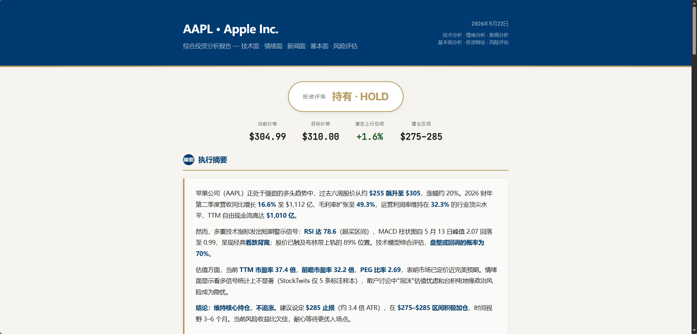

# TradingAgents-CN-lite

**轻量级多Agent交易分析框架**（A股、港股、美股等）

[](LICENSE) [](https://www.python.org/) [](https://github.com/cy-Yin/TradingAgents-CN-lite/commits/main)

[English](README.md) | [中文](README_cn.md)

---

TradingAgents-CN-lite 是 [TauricResearch/TradingAgents](https://github.com/TauricResearch/TradingAgents) 的轻量级 fork，新增了 **A股数据支持**（BaoStock + AkShare + 东方财富股吧），同时保持原版 CLI 架构不变。灵感来自 [hsliuping/TradingAgents-CN](https://github.com/hsliuping/TradingAgents-CN)。

> 如果需要带 Web 界面、数据库和企业功能的完整部署方案，请看 [TradingAgents-CN](https://github.com/hsliuping/TradingAgents-CN)。

> [!WARNING]
> 本项目仅供**研究和学习使用**，不构成任何投资建议。交易表现取决于模型选择、市场环境、数据质量等多种因素，风险自负。

## 致谢

| 项目 | 说明 |
|------|------|
| [TauricResearch/TradingAgents](https://github.com/TauricResearch/TradingAgents) | 原版多Agent LLM交易框架 |
| [hsliuping/TradingAgents-CN](https://github.com/hsliuping/TradingAgents-CN) | 完整中文增强版，带Web UI和企业功能 |

## 概览

### 它能做什么

给它一个**股票代码**和一个**日期**，它会派出一组AI分析师从各个角度分析这只股票——基本面、新闻、情绪、技术面——然后通过多轮辩论得出交易建议。最终输出**买入/卖出/持有**的结论，附带完整的分析报告（Markdown + HTML 中英文版）。

**支持的市场：**

- **A股** — 沪市（60xxxx）、深市（00xxxx/30xxxx）、北交所（8xxxxx）。股价和技术指标来自 [BaoStock](https://github.com/jealous/stockstats)；基本面、财务报表和新闻来自 [AkShare](https://github.com/akfamily/akshare)；散户情绪来自东方财富股吧；宏观新闻来自CCTV财经。基准指数：沪深300 / 北证50。
- **港股** — 通过 yfinance（如 `0700.HK`）。基准：恒生指数。
- **美股/全球** — 通过 yfinance 或 Alpha Vantage（如 `NVDA`、`AAPL`）。情绪来自 Reddit + StockTwits。基准：SPY。

系统会根据股票代码格式自动识别市场，无需手动配置。

### 有什么不同

| 功能 | [TradingAgents](https://github.com/TauricResearch/TradingAgents)（原版） | [TradingAgents-CN](https://github.com/hsliuping/TradingAgents-CN) | 本项目 |
|------|-----|------|------|
| A股股价/指标（BaoStock） | -- | 有 | 有 |
| A股基本面/财报（AkShare） | -- | 有 | 有 |
| A股新闻（AkShare） | -- | 有 | 有 |
| A股散户情绪（东方财富股吧） | -- | 有 | 有 |
| A股宏观新闻（CCTV财经） | -- | 有 | 有 |
| 中文大模型 | 有（v0.2.4+） | 有 | 有 |
| 美股/港股/全球市场 | 有 | 有 | 有 |
| CLI 命令行 | 有 | -- | 有 |
| Web 界面（Vue + FastAPI） | -- | 有 | -- |
| MongoDB / Redis | -- | 有 | -- |
| Docker 部署 | 有 | 有 | -- |
| 用户认证和权限 | -- | 有 | -- |

> [!NOTE]
> **为什么叫"lite"？** TradingAgents-CN 是一个完整产品——Web界面、MongoDB、Redis、Docker、用户认证，什么都有。本项目只保留核心引擎 + A股数据，没有Web层、没有数据库、没有容器。

### 运行原理

<p align="center">
  
</p>

> **输入：** 股票代码 + 日期
> **输出：** 买入 / 卖出 / 持有 + 完整分析报告（Markdown + HTML 中英文版）

#### 第一阶段 — 分析

四个专业分析师**并行工作**，各从一个角度分析股票：

| 分析师 | 做什么 | 数据来源 |
|--------|-------|---------|
| 📊 基本面 | 财务报表、资产负债表、现金流 | AkShare / yfinance |
| 💬 情绪 | 社交媒体和论坛情绪 | 东方财富股吧 / Reddit / StockTwits |
| 📰 新闻 | 宏观和公司层面的新闻 | CCTV财经 / yfinance |
| 📈 技术面 | MACD、RSI、布林带等指标 | BaoStock / yfinance |

#### 第二阶段 — 辩论

🐂 **多头研究员** 看好这只股票，列出看涨理由。
🐻 **空头研究员** 看空这只股票，列出看跌理由。

两人互相挑战对方的推理，进行 **N 轮**辩论。

<p align="center">
  
</p>

#### 第三阶段 — 决策

🧑‍💼 **研究主管** 综合辩论结果，形成统一的研究报告。
🤵 **交易员** 根据报告做出初步交易判断。

#### 第四阶段 — 风险审查

三个风险分析师从不同角度讨论这笔交易：

| 🔴 激进派 | 🟡 保守派 | ⚪ 中性派 |
|:---:|:---:|:---:|
| 高风险偏好 | 风险厌恶 | 平衡视角 |

#### 第五阶段 — 最终拍板

👑 **投资组合经理** 做出最终的 **买入 / 卖出 / 持有** 决定。
📝 **报告生成** 输出结构化 Markdown + 设计感 HTML 报告。

## 快速开始

### 1. 安装

```bash
git clone https://github.com/cy-Yin/TradingAgents-CN-lite.git
cd TradingAgents-CN-lite
```

<details open>
<summary><b>uv</b>（推荐）</summary>

```bash
# 安装 uv（选一个）
pip install uv           # 通过 pip
brew install uv          # 通过 Homebrew (macOS)
curl -LsSf https://astral.sh/uv/install.sh | sh  # 独立安装器

# 创建虚拟环境并安装
uv venv -p 3.13
uv pip install .
```
</details>

<details>
<summary><b>conda</b></summary>

```bash
conda create -n tradingagents python=3.13
conda activate tradingagents
pip install .
```
</details>

<details>
<summary><b>pyenv</b></summary>

```bash
pyenv install 3.13
pyenv virtualenv 3.13 tradingagents
pyenv activate tradingagents
pip install .
```
</details>

### 2. 配置

打开 `.env`，按以下步骤填写：

**① API密钥** — 填一个。支持 OpenAI、DeepSeek、通义千问、智谱GLM、MiniMax、Claude、Gemini、Grok、小米 Mimo、Ollama（本地）等。详见 `.env.example`。

<details>
<summary><b>完整提供商列表</b></summary>

| 提供商 | 环境变量 | 模型 |
|--------|---------|------|
| OpenAI | `OPENAI_API_KEY` | GPT-5.5, GPT-5.4, GPT-5.2, GPT-4.1 |
| DeepSeek | `DEEPSEEK_API_KEY` | V4 Pro, V4 Flash, V3.2 |
| 通义千问（国际） | `DASHSCOPE_API_KEY` | Qwen 3.6 Plus/Flash, Qwen 3.5 |
| 通义千问（国内） | `DASHSCOPE_CN_API_KEY` | 同上，国内节点 |
| 智谱（国际） | `ZHIPU_API_KEY` | GLM-5.1, GLM-5, GLM-5-Turbo |
| 智谱（国内） | `ZHIPU_CN_API_KEY` | 同上，BigModel.cn |
| MiniMax（国际） | `MINIMAX_API_KEY` | M2.7, M2.5, M2.1 |
| MiniMax（国内） | `MINIMAX_CN_API_KEY` | 同上，国内节点 |
| Anthropic | `ANTHROPIC_API_KEY` | Claude Opus 4.7, Claude Sonnet 4.6 |
| Google | `GOOGLE_API_KEY` | Gemini 3.1 Pro, Gemini 3 Flash |
| xAI | `XAI_API_KEY` | Grok 4.20, Grok 4 |
| OpenRouter | `OPENROUTER_API_KEY` | 多模型网关 |
| 小米 Mimo | `OPENAI_API_KEY` | 通过 OpenAI 兼容接口 |
| Ollama | *（本地）* | Qwen3, GLM-4.7-Flash 等 |

</details>

**② 模型和行为** — 通过 `TRADINGAGENTS_*` 变量覆盖默认值：

| 变量 | 默认值 | 可选值 |
|------|-------|-------|
| `TRADINGAGENTS_LLM_PROVIDER` | `openai` | `openai`, `deepseek`, `qwen`, `qwen-cn`, `glm`, `glm-cn`, `minimax`, `minimax-cn`, `anthropic`, `google`, `xai`, `openrouter`, `ollama` |
| `TRADINGAGENTS_DEEP_THINK_LLM` | `gpt-5.4` | 辩论和决策用的模型ID |
| `TRADINGAGENTS_QUICK_THINK_LLM` | `gpt-5.4-mini` | 数据摘要用的模型ID |
| `TRADINGAGENTS_OUTPUT_LANGUAGE` | `English` | `English`, `Chinese` |
| `TRADINGAGENTS_MAX_DEBATE_ROUNDS` | `1` | 多空辩论轮数（最大: 3） |
| `TRADINGAGENTS_MAX_RISK_ROUNDS` | `1` | 风险管理辩论轮数（最大: 3） |

<details>
<summary><b>.env 配置示例（DeepSeek）</b></summary>

```bash
# ① API密钥
DEEPSEEK_API_KEY=<your-api-key-here>

# ② 模型和行为
TRADINGAGENTS_LLM_PROVIDER=deepseek
TRADINGAGENTS_DEEP_THINK_LLM=deepseek-v4-pro
TRADINGAGENTS_QUICK_THINK_LLM=deepseek-v4-flash
TRADINGAGENTS_OUTPUT_LANGUAGE=Chinese
TRADINGAGENTS_MAX_DEBATE_ROUNDS=3
TRADINGAGENTS_MAX_RISK_ROUNDS=3
```
</details>

### 3. 运行

先在 `main.py` 中修改股票代码和日期：

```python
ticker = "002594"       # 默认：比亚迪
trade_date = "2026-05-25"
```

然后运行：

```bash
uv run python main.py
```

### 4. 获取报告

报告保存在 `reports/` 目录，包含 Markdown 和 HTML（中英文版）。

<details>
<summary><b>示例报告</b></summary>

<p align="center">
  
</p>
</details>

---

<p align="center">
  基于 <a href="https://github.com/TauricResearch/TradingAgents">TradingAgents</a> 构建，原版由 Tauric Research 开发
</p>
